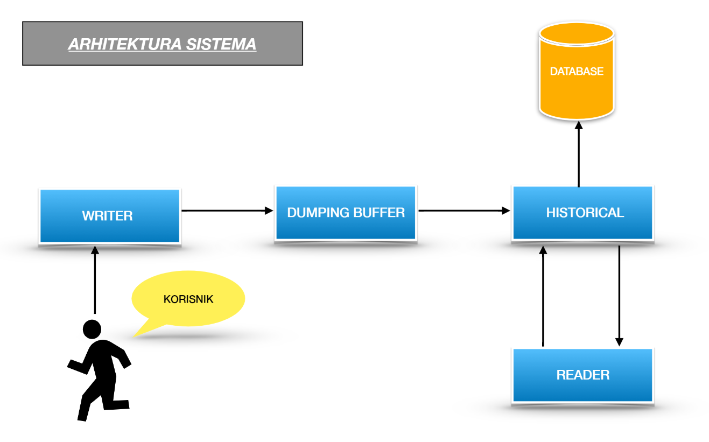

## PROJEKAT ERS

## O Projektu
Ovo je projekat iz predmeta elementi razvoja softvera. 
Projekat predstavlja aplikaciju koja ce omoguciti korisniku da unosi podatke o trenutnoj potrosnji toplotne energije u bazu podataka, kao i mogucnosti citanja podataka.

## Arhiktetura sistema
Dijagram arhikteture sistema za projekat "Cache Memory"

  
